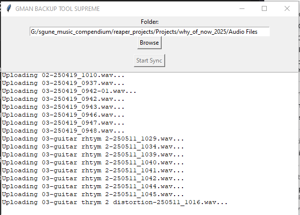
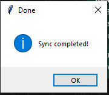

# swasta-masta-gman-storage
स्वस्त आणि मस्त  GMAN Storage. Cuz things are hella expensive and yaboi don't wanna pay a ton for my storage solutions.

# GCP time 
We are going to use GCP Storage as our desired solution. Because paishey naahi aahet.

## Kevdha Swasta?

Coldline Storage is a highly durable, low-cost service for storing data which is infrequently accessed. Coldline Storage is a superior option than Nearline Storage or Standard Storage in situations where a 90-day minimum storage time, a tiny bit less availability, and higher costs related to data access are admissible trade-offs for less at-rest storage charges.

Nearline Storage costs:

- $0.007 per GB-month for storage

- $0.02/GB for data retrieval

Yevdha Swasta: https://cloud.google.com/storage/pricing

Azun Samzav: https://cloud.google.com/storage/pricing-examples 


## Install Gcloud
https://cloud.google.com/sdk/docs/install

If you on Windows, it be right here: https://dl.google.com/dl/cloudsdk/channels/rapid/GoogleCloudSDKInstaller.exe


# Gcloud stuff to get User creds to do the deeds
```
gcloud iam service-accounts keys create /path/to/key-file.json --iam-account=gman-service-account@<your-project-id>.iam.gserviceaccount.com

gcloud projects add-iam-policy-binding <your-project-id> --member="serviceAccount:gman-service-account@<your-project-id>.iam.gserviceaccount.com" --role="roles/storage.admin"


```

## Bringing stuff into existence
`terraform init`
<details> 

```
terraform init -var-file=swasta_masta.tfvars

Initializing the backend...

Initializing provider plugins...
- Finding latest version of hashicorp/google...
- Installing hashicorp/google v5.3.0...
- Installed hashicorp/google v5.3.0 (signed by HashiCorp)

Terraform has created a lock file .terraform.lock.hcl to record the provider
selections it made above. Include this file in your version control repository
so that Terraform can guarantee to make the same selections by default when
you run "terraform init" in the future.

Terraform has been successfully initialized!

You may now begin working with Terraform. Try running "terraform plan" to see
any changes that are required for your infrastructure. All Terraform commands
should now work.

If you ever set or change modules or backend configuration for Terraform,
rerun this command to reinitialize your working directory. If you forget, other
commands will detect it and remind you to do so if necessary.
```
</details>


- Make sure you actually add in your values to `swasta_masta.tfvars`

`terraform apply -var-file=swasta_masta.tfvars`
<details>

```
❯ terraform apply -var-file=gman.tfvars
data.google_iam_policy.allUsers: Reading...
data.google_iam_policy.allUsers: Read complete after 0s [id=2157760748]

Terraform used the selected providers to generate the following execution plan. Resource actions are indicated with the
following symbols:
  + create

Terraform will perform the following actions:

  # google_storage_bucket.gman_bucket will be created
  + resource "google_storage_bucket" "gman_bucket" {
      + effective_labels            = (known after apply)
      + force_destroy               = true
      + id                          = (known after apply)
      + location                    = "US-CENTRAL1"
      + name                        = "gman-bucket"
      + project                     = (known after apply)
      + public_access_prevention    = "inherited"
      + self_link                   = (known after apply)
      + storage_class               = "COLDLINE"
      + terraform_labels            = (known after apply)
      + uniform_bucket_level_access = true
      + url                         = (known after apply)
    }

  # google_storage_bucket_iam_member.bucket_iam will be created
  + resource "google_storage_bucket_iam_member" "bucket_iam" {
      + bucket = "gman-bucket"
      + etag   = (known after apply)
      + id     = (known after apply)
      + member = "serviceAccount:gman-storage-admin@angelic-digit-297517.iam.gserviceaccount.com"
      + role   = "roles/storage.admin"
    }

  # google_storage_bucket_iam_policy.gman_bucket_policy will be created
  + resource "google_storage_bucket_iam_policy" "gman_bucket_policy" {
      + bucket      = "gman-bucket"
      + etag        = (known after apply)
      + id          = (known after apply)
      + policy_data = jsonencode(
            {
              + bindings = [
                  + {
                      + members = [
                          + "allUsers",
                        ]
                      + role    = "roles/storage.objectViewer"
                    },
                ]
            }
        )
    }

Plan: 3 to add, 0 to change, 0 to destroy.

Do you want to perform these actions?
  Terraform will perform the actions described above.
  Only 'yes' will be accepted to approve.

  Enter a value: yes

google_storage_bucket.gman_bucket: Creating...
google_storage_bucket.gman_bucket: Creation complete after 0s [id=gman-bucket]
google_storage_bucket_iam_policy.gman_bucket_policy: Creating...
google_storage_bucket_iam_member.bucket_iam: Creating...
google_storage_bucket_iam_policy.gman_bucket_policy: Creation complete after 6s [id=b/gman-bucket]
google_storage_bucket_iam_member.bucket_iam: Creation complete after 6s [id=b/gman-bucket/roles/storage.admin/serviceAccount:gman-storage-admin@angelic-digit-297517.iam.gserviceaccount.com]
```
</details>

## Arey but bucket create hua kya?
Lets C

`gcloud storage buckets list --project your-project-id`

``` 
creation_time: DA_TIMESTAMP
default_storage_class: COLDLINE
location: US
location_type: multi-region
metageneration: 2
name: gman-bucket
public_access_prevention: inherited
rpo: DEFAULT
storage_url: gs://gman-bucket/
uniform_bucket_level_access: true
```

## Achcha okay, so how do I take my local stuff and throw it in there?

- lets say you have a folder mystuff (it will be included in this repo)

- Add a text file in that folder, hello_there.txt

- GSUTIL lagega: `gcloud components install gsutil`
- Authenticate your service account: `gcloud auth activate-service-account --key-file=<YOUR_SA_JSON>`
- Sync Command :  `gsutil -m rsync -r <YOUR_FOLDER> gs://gman-bucket/`
- Lets C
```
gsutil -m rsync \\wsl$\Ubuntu/home/sgune/devs/swasta-masta-gman-storage/mystuff gs://gman-bucket/mystuff
Building synchronization state...
Starting synchronization...
Copying file://\\wsl$\Ubuntu\home\sgune\devs\swasta-masta-gman-storage\mystuff\hello_there.txt [Content-Type=text/plain]...
/ [1/1 files][   15.0 B/   15.0 B] 100% Done
Operation completed over 1 objects/15.0 B.
```
- But actual mein file hai kya?
```
C:\Users\sgune\AppData\Local\Google\Cloud SDK>gsutil ls -L gs://gman-bucket/*
gs://gman-bucket/mystuff/hello_there.txt:
    Creation time:          Thu, 26 Oct 2023 22:26:51 GMT
    Update time:            Thu, 26 Oct 2023 22:26:51 GMT
    Storage class:          COLDLINE
    Content-Language:       en
    Content-Length:         15
    Content-Type:           text/plain
    Metadata:
        goog-reserved-file-mtime:1698358791
    Hash (crc32c):          nV6kEA==
    Hash (md5):             yygoMGizjL6L1P2RnwbwBA==
    ETag:                   CNrz5ovhlIIDEAE=
    Generation:             1698359211047386
    Metageneration:         1
    ACL:                    []
TOTAL: 1 objects, 15 bytes (15 B)
```
- File actually mein hai ki bas paka rahaa hai?
```
C:\Users\sgune\AppData\Local\Google\Cloud SDK>gsutil cat gs://gman-bucket/mystuff/hello_there.txt
GENERAL KENOBI!
```

# You still don't believe me? Ye le.
https://storage.googleapis.com/gman-bucket/mystuff/hello_there.txt 

## Cleanup
`terraform destroy`
<details>

```
❯ terraform destroy -var-file=gman.tfvars
data.google_iam_policy.allUsers: Reading...
google_storage_bucket.gman_bucket: Refreshing state... [id=gman-bucket]
data.google_iam_policy.allUsers: Read complete after 0s [id=2157760748]
google_storage_bucket_iam_policy.gman_bucket_policy: Refreshing state... [id=b/gman-bucket]
google_storage_bucket_iam_member.bucket_iam: Refreshing state... [id=b/gman-bucket/roles/storage.admin/serviceAccount:gman-storage-admin@angelic-digit-297517.iam.gserviceaccount.com]

Terraform used the selected providers to generate the following execution plan. Resource actions are indicated with the
following symbols:
  - destroy

Terraform will perform the following actions:

  # google_storage_bucket.gman_bucket will be destroyed
  - resource "google_storage_bucket" "gman_bucket" {
      - default_event_based_hold    = false -> null
      - effective_labels            = {} -> null
      - force_destroy               = true -> null
      - id                          = "gman-bucket" -> null
      - labels                      = {} -> null
      - location                    = "US-CENTRAL1" -> null
      - name                        = "gman-bucket" -> null
      - project                     = "angelic-digit-297517" -> null
      - public_access_prevention    = "inherited" -> null
      - requester_pays              = false -> null
      - self_link                   = "https://www.googleapis.com/storage/v1/b/gman-bucket" -> null
      - storage_class               = "COLDLINE" -> null
      - terraform_labels            = {} -> null
      - uniform_bucket_level_access = true -> null
      - url                         = "gs://gman-bucket" -> null
    }

  # google_storage_bucket_iam_member.bucket_iam will be destroyed
  - resource "google_storage_bucket_iam_member" "bucket_iam" {
      - bucket = "b/gman-bucket" -> null
      - etag   = "CAM=" -> null
      - id     = "b/gman-bucket/roles/storage.admin/serviceAccount:gman-storage-admin@angelic-digit-297517.iam.gserviceaccount.com" -> null
      - member = "serviceAccount:gman-storage-admin@angelic-digit-297517.iam.gserviceaccount.com" -> null
      - role   = "roles/storage.admin" -> null
    }

  # google_storage_bucket_iam_policy.gman_bucket_policy will be destroyed
  - resource "google_storage_bucket_iam_policy" "gman_bucket_policy" {
      - bucket      = "b/gman-bucket" -> null
      - etag        = "CAM=" -> null
      - id          = "b/gman-bucket" -> null
      - policy_data = jsonencode(
            {
              - bindings = [
                  - {
                      - members = [
                          - "serviceAccount:gman-storage-admin@angelic-digit-297517.iam.gserviceaccount.com",
                        ]
                      - role    = "roles/storage.admin"
                    },
                  - {
                      - members = [
                          - "allUsers",
                        ]
                      - role    = "roles/storage.objectViewer"
                    },
                ]
            }
        ) -> null
    }

Plan: 0 to add, 0 to change, 3 to destroy.

Do you really want to destroy all resources?
  Terraform will destroy all your managed infrastructure, as shown above.
  There is no undo. Only 'yes' will be accepted to confirm.

  Enter a value: no
```


</details>

## GGWP
So there you go. Now you got cheap storage, for life.

## Audio sync tool
Go to the release section and you can download the build. But if you ain't got the perms, you gonna have to use my code to make modifications for your own bucket.



